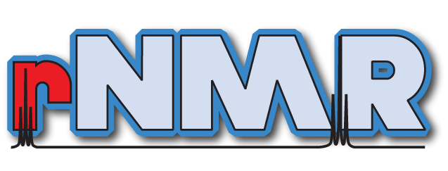

<!-- Guidance:
Logo: The logo needs have the text "Logo" inside the square bracket place holder to be recognized at the App Library.
Tool name: First single hashtag will be taken as tool name.
Version: Should always go after the first hastag and before the second hastag. The line needs to respond to the regexp "^Version: (.+)" being the first group the actual version.

Fields: for the App Library, the following fields will be parsed

## Short description
## Description
## Key features
## Publications
## Screenshots
## Provider
## Website
## Usage Instructions
## Installation 

They all have to be at the second hashtag level

For screenshots, you should use the following scheme:

-->

# rNMR
Version: 1.0

## Short description

<!-- 
This should only be 20 to 40 words, hopefully a single sentence.
-->

open source software for identifying and quantifying metabolites in NMR spectra.

## Description

Dockerify rNMR: open source software for identifying and quantifying metabolites in NMR spectra, developed by the team around Ian A. Lewis (University of Calgary), see http://http://rnmr.nmrfam.wisc.edu/.

rNMR is an open source software package for visualizing and interpreting one and two dimensional NMR data. In contrast to most existing 2D NMR software, rNMR is specifically designed for high-throughput assignment and quantification of small molecules. As a result, rNMR supports extensive batch manipulation of plotting parameters and has numerous tools for expediting repetitive resonance assignment and quantification tasks.

The most powerful features of rNMR are built around the region of interest (ROI) concept. ROIs are user-defined chemical shift ranges that can be used to visualize and analyze hundreds of NMR signals from multiple spectra simultaneously. Unlike peak tables, ROIs are dynamic representations of the underlying NMR data. Users can actively manipulate the chemical shift ranges of ROIs while simultaneously visualizing the impact these changes will have on resonance assignments and quantification of signals.

## Key features

- NMR Processing

## Publications

<!-- Guidance:
Use AMA style publications as a list (you can export AMA from PubMed, on the Formats: Citation link when looking at the entry).
-->

- Lewis IA, Schommer SC, Markley JL. rNMR: open source software for identifying and quantifying metabolites in NMR spectra. Magnetic Resonance in Chemistry . 2009;47(S1):S123-S126. doi:10.1002/mrc.2526.

## Screenshots

## Provider

## Website

## Usage Instructions

## Installation 

